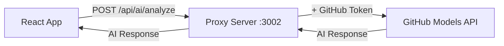

# 🚀 Enable AI Insights - CORS Fix

## The Problem
GitHub Models API blocks requests from browsers due to CORS policy.  
**Solution**: Use a local proxy server that forwards requests.

---

## ✅ Quick Setup (2 minutes)

### Step 1: Install Dependencies
```powershell
npm install
```

This will install:
- `express` - Web server
- `cors` - CORS handling
- `dotenv` - Environment variables
- `node-fetch` - HTTP requests
- `concurrently` - Run multiple commands

### Step 2: Start Both Servers
```powershell
npm run dev:all
```

This starts:
1. **Vite dev server** on `http://localhost:3000`
2. **AI proxy server** on `http://localhost:3002`

You should see:
```
╔═══════════════════════════════════════════════════════════╗
║  🤖 AI Insights Proxy Server                              ║
║  Status: ✅ Running on http://localhost:3002            ║
╚═══════════════════════════════════════════════════════════╝
```

### Step 3: Test
1. Open `http://localhost:3000/Prism`
2. Click on an Area Manager
3. Open "Monthly Performance Analysis"
4. Check console - should see:
   ```
   🌐 Using proxy endpoint: http://localhost:3002/api/ai/analyze
   ✅ AI analysis successful!
   ```

---

## 🔧 Alternative: Run Servers Separately

If `npm run dev:all` doesn't work:

**Terminal 1 - Frontend:**
```powershell
npm run dev
```

**Terminal 2 - Proxy:**
```powershell
npm run proxy
```

---

## ✅ What Changed?

### Before (CORS Error):
```
Browser → https://models.github.ai ❌ CORS blocked
```

### After (Working):
```
Browser → http://localhost:3002 → https://models.github.ai ✅
```

The proxy server:
1. Runs on your machine (no CORS issues with localhost)
2. Receives requests from browser
3. Forwards them to GitHub Models API with your token
4. Returns AI responses to browser

---

## 🐛 Troubleshooting

### Problem: "Cannot find module 'express'"
**Solution**: Run `npm install` first

### Problem: Port 3002 already in use
**Solution**: Stop other processes or change port in `server/proxy.js`

### Problem: Still seeing "Basic Analysis"
**Check**:
1. Is proxy server running? (`http://localhost:3002/health`)
2. Is `.env` file present with `VITE_GITHUB_TOKEN`?
3. Check browser console for errors

### Problem: "ECONNREFUSED localhost:3002"
**Solution**: Proxy server isn't running. Start it with `npm run proxy`

---

## 📝 How It Works



1. **React app** calls `http://localhost:3002/api/ai/analyze`
2. **Proxy server** adds your GitHub token from `.env`
3. **Proxy** forwards request to `https://models.github.ai/v1/chat/completions`
4. **GitHub Models** processes request and returns AI insights
5. **Proxy** returns response to React app
6. **React app** displays AI insights

---

## 🎯 Expected Results

### Console Logs:
```
🔍 Checking GitHub token availability: ✅ Token found
🚀 Attempting AI analysis with GitHub Models...
🌐 Using proxy endpoint: http://localhost:3002/api/ai/analyze
✅ AI analysis successful!
```

### In App:
- ✅ No more "Basic Analysis" label
- ✅ AI-generated insights about TWC coffee operations
- ✅ Coffee-specific terminology (barista, espresso, ZingLearn)
- ✅ Detailed root cause analysis

---

## 💡 Production Deployment

For production, you'll need to:
1. Deploy proxy server separately (Heroku, Railway, Render, etc.)
2. Update endpoint in `aiInsightsService.ts` to production URL
3. Keep GitHub token secure in environment variables

---

## 🆘 Still Not Working?

Run these checks:

**1. Check proxy health:**
```powershell
curl http://localhost:3002/health
```
Should return: `{"status":"ok","message":"Proxy server is running"}`

**2. Check .env file:**
```powershell
Get-Content .env
```
Should show: `VITE_GITHUB_TOKEN=ghp_...`

**3. Check if proxy is using token:**
Look at proxy server terminal - should show:
```
🚀 Proxying request to GitHub Models API...
✅ GitHub Models API success
```

If you see `❌ GitHub Models API error: 401`, your token is invalid.

---

## ✨ Summary

- ✅ Created local proxy server (`server/proxy.js`)
- ✅ Updated package.json with new scripts
- ✅ Updated AI service to use proxy
- ⏳ **Next**: Run `npm install` then `npm run dev:all`
